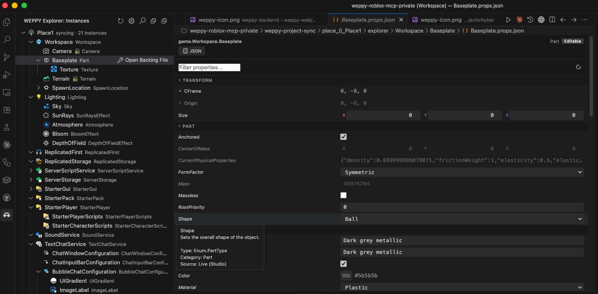

# WEPPY Roblox Explorer Guide

**WEPPY Roblox Explorer** is a companion VSCode/Antigravity extension that mirrors the Roblox Studio Explorer tree directly inside your editor. Browse synced instances, open scripts, and edit properties without constantly switching between Studio and your editor.

> **Optional** — Explorer is not required. The MCP server and the Roblox Studio plugin are enough to use every core feature. Install Explorer when you want to browse project structure or inspect/edit properties right from your editor.

## Why Use Explorer

AI agents can already understand the entire project context from the files generated by Sync, but when a human browses the mirror, file paths alone do not make the hierarchy obvious. Explorer reuses the same sync data and renders it as the **same tree you see in Roblox Studio**, which makes the following much easier:

- See at a glance which service/instance a script belongs to
- Quickly locate instances across services by name or path
- Check per-file sync status (modified / studio / conflict)
- Edit properties without switching to Studio

## Requirements

- VSCode 1.85+ or Antigravity
- [Roblox MCP](../installation/README.md) installed with Sync enabled (Basic or Pro)
- A Sync-generated `weppy-project-sync/place_*/.sync-meta.json` under your project root

Explorer works purely from the on-disk sync files by default. When the local MCP server is running, live sync state and direction information are reflected as well.

## Installation

Search for **WEPPY Roblox Explorer** in the Extensions sidebar (`Ctrl+Shift+X` / `Cmd+Shift+X`) of VSCode or Antigravity and click **Install**.

Direct marketplace links:

- [VS Code Marketplace](https://marketplace.visualstudio.com/items?itemName=weppy.weppy-roblox-explorer)
- [Open VSX](https://open-vsx.org/extension/weppy/weppy-roblox-explorer)

## Browsing the Instance Tree

After installing, a **WEPPY Explorer** view appears in the VSCode Activity Bar and auto-discovers the sync directory from your project root.

- **Service roots**: Synced services such as `Workspace`, `ReplicatedStorage`, and `ServerScriptService` appear at the top level.
- **Roblox class icons**: Over 200 Studio-style icons that switch automatically between dark and light themes.
- **Multi-place support**: Each synced Place is shown as its own tree root when multiple places exist.
- **Auto refresh**: The tree updates with a 500ms debounce whenever sync files change.
- **Sync status badges**: `modified`, `studio`, and `conflict` states are shown next to icons so you can spot changes and conflicts immediately.

Clicking a tree item opens the file that backs the instance (`.server.luau`, `.client.luau`, `.module.luau`, `.props.json`, ...). The right-click menu lets you copy the instance path in `game.Workspace.Part` format or reveal the backing file in the default VSCode explorer.

## Property Panel

Select an instance in the Explorer tree and run **Open Properties** to launch a panel that looks just like the Properties window in Studio. You can inspect and edit properties in grouped form without touching the `.props.json` file directly.

- **Grouped display**: Properties are sorted into the same groups as Studio (Appearance, Behavior, Data, Part, Transform, and so on).
- **Type-aware editors**: Input widgets match the property type — numbers, strings, booleans, colors, Vector3, enums, and more.
- **File-backed editing**: Changes are written to the instance's `*.props.json` file and flow back to Studio through Sync's reverse path (Pro, when bidirectional is enabled).
- **Custom editor binding**: Opening a `.props.json` file directly uses the Property Panel instead of the default text editor.

If you want the Property Panel to open automatically as you click around the tree, set `robloxExplorer.propertyPanel.autoOpen` to `true` in settings.

## Searching Instances

Run `WEPPY Explorer: Search Instances` (from the view title icon or the Command Palette) to open a QuickPick that searches across every synced service.

- Partial matches against instance names
- Selecting a result focuses the tree on the matching item
- When multiple places are synced, results are scoped per place

## Settings

| Setting | Default | Description |
|---------|---------|-------------|
| `robloxExplorer.mcpBaseUrl` | `""` | Local MCP HTTP base URL. If empty, Explorer tries `http://127.0.0.1:3002` and then `http://127.0.0.1:3003`. |
| `robloxExplorer.syncRoot` | `""` | Absolute path to the `weppy-project-sync` root. Auto-discovered from workspace folders when empty. |
| `robloxExplorer.hidePropsFiles` | `false` | Hide sync artifacts (`.props.json`, `_tree.json`, `.value.json`) in the default VSCode explorer. |
| `robloxExplorer.autoRefresh` | `true` | Auto-refresh the tree when sync files change. |
| `robloxExplorer.showSyncStatus` | `true` | Show sync status decorations on tree items. |
| `robloxExplorer.followFocusCue` | `false` | Follow external focus cue files by best-effort tree reveal and script file open. |
| `robloxExplorer.propertyPanel.autoOpen` | `false` | Automatically open the Property Panel when you select an instance in the tree. |

## Commands

| Command | Description |
|---------|-------------|
| `WEPPY Explorer: Refresh` | Manually refresh the instance tree |
| `WEPPY Explorer: Search Instances` | Search for instances across every service |
| `WEPPY Explorer: Open Backing File` | Open the backing file for the selected instance |
| `WEPPY Explorer: Open Properties` | Open the Property Panel for the selected instance |
| `WEPPY Explorer: Copy Instance Path` | Copy the full instance path (e.g. `game.Workspace.Part`) |
| `WEPPY Explorer: Reveal in Explorer` | Show the backing file in the default VSCode explorer |
| `WEPPY Explorer: Collapse All` | Collapse every tree node |
| `WEPPY Explorer: Open Settings` | Open the Explorer settings page |

## Troubleshooting

- **Tree is empty**: Check that the `weppy-project-sync/place_*` directory exists and that Sync has completed at least one Full Sync. Set `robloxExplorer.syncRoot` manually if needed.
- **Sync status does not appear**: Make sure the local MCP server is running and try setting `robloxExplorer.mcpBaseUrl` explicitly.
- **Property Panel does not open**: If a `.props.json` file opens in the default text editor, right-click the file and choose **Reopen Editor With... → WEPPY Property Panel**.
- **Icons look broken**: Re-select your VSCode theme or restart the window to refresh the icon cache.

## See Also

- [Roblox MCP Installation Guide](../installation/README.md)
- [Sync Guide](../sync/overview.md)
- [Tools Overview](../tools/overview.md)
