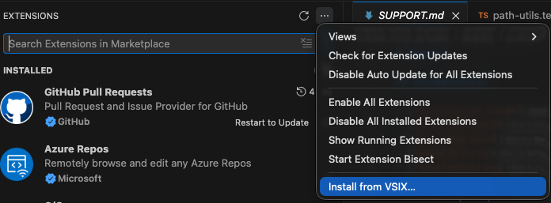

# Weepy Roblox Explorer (VSCode Extension)

Roblox Studio Explorer-like tree view for VSCode. Browse synced instance trees, open scripts directly, and track sync status — all inside your editor.

## Requirements

- VSCode 1.85+
- [Roblox MCP](../../../README.md) Sync enabled (Basic or Pro)

## Installation

### 1. Download VSIX

Go to the [Releases](https://github.com/hope1026/roblox-mcp/releases) page and download the latest `weppy-roblox-explorer-*.vsix` file.

> The VSIX file is attached as a release asset alongside the plugin ZIP.

### 2. Install in VSCode

1. Open VSCode
2. Open the Extensions sidebar (`Ctrl+Shift+X` / `Cmd+Shift+X`)
3. Click the `...` menu at the top → **Install from VSIX...**

4. Select the downloaded `.vsix` file
5. Reload VSCode when prompted

## Features

- **Instance tree**: Service/instance hierarchy matching Roblox Studio
- **Roblox class icons**: Dark/light theme support with 200+ class icons
- **Multi-place**: Separate tree roots per synced place
- **Click-to-open**: Open backing files (`.server.luau`, `.client.luau`, `.module.luau`, `.props.json`)
- **Instance search**: QuickPick search across all services
- **Sync status badges**: See `modified`, `studio`, `conflict` states at a glance
- **Auto-refresh**: Tree updates automatically when sync files change (500ms debounce)
- **Copy instance path**: Right-click to copy `game.Workspace.Part` style paths

## Settings

| Setting | Default | Description |
|---------|---------|-------------|
| `robloxExplorer.syncRoot` | `""` | Absolute path to `roblox-project-sync` root. Auto-discovered if empty. |
| `robloxExplorer.hidePropsFiles` | `false` | Hide sync artifact files (`.props.json`, `_tree.json`, `.value.json`) in the default VSCode explorer. |
| `robloxExplorer.autoRefresh` | `true` | Auto-refresh tree when sync files change. |
| `robloxExplorer.showSyncStatus` | `true` | Show sync status decorations on tree items. |

## Commands

| Command | Description |
|---------|-------------|
| `Weepy Roblox Explorer: Refresh` | Manually refresh the instance tree |
| `Weepy Roblox Explorer: Search Instances` | Search instances across all services |
| `Weepy Roblox Explorer: Open Backing File` | Open the file backing a selected instance |
| `Weepy Roblox Explorer: Copy Instance Path` | Copy the full instance path (e.g. `game.Workspace.Part`) |
| `Weepy Roblox Explorer: Reveal in Explorer` | Show the backing file in the default VSCode explorer |

## Updating

Download the latest `.vsix` from [Releases](https://github.com/hope1026/roblox-mcp/releases) and repeat the installation steps. VSCode will replace the existing version.

## Related

- [Sync Deep Dive](../sync/overview.md)
- [Installation Guide](README.md)
