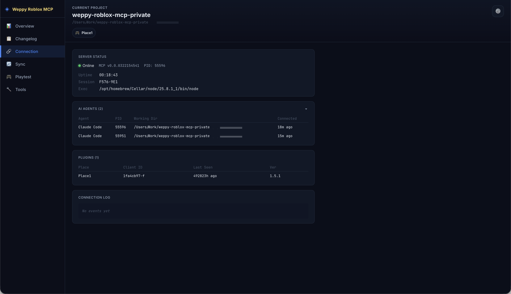

# Connection

> Monitorea el estado de conexion del servidor, los agentes de IA y el plugin en un solo lugar.



## Descripcion general

La pagina Connection permite monitorear todos los estados de conexion del sistema MCP en un solo lugar. Es accesible siempre que el dashboard este en estado **Servidor conectado** o **Studio conectado**.

## Server Status

Muestra la informacion esencial del servidor:

| Campo | Descripcion |
|-------|-------------|
| Status | Indicador de estado de conexion (Online/Offline) |
| Version | Version del servidor MCP |
| PID | ID de proceso del servidor |
| Uptime | Tiempo de actividad del servidor |
| Session ID | Identificador de la sesion actual |
| Exec Path | Ruta de ejecucion del servidor |

## AI Agents

Muestra en una tabla la lista de agentes de IA actualmente conectados:

| Columna | Descripcion |
|---------|-------------|
| Name | Nombre del agente (ej: Claude Code) |
| PID | ID de proceso del agente |
| Working Dir | Directorio de trabajo del agente |
| Connected | Tiempo transcurrido desde la conexion |

Si hay varios agentes conectados simultaneamente, se muestran todos.

## Plugins

Muestra la lista de plugins de Roblox Studio conectados:

| Columna | Descripcion |
|---------|-------------|
| Place | Nombre del Place |
| Client ID | Identificador del cliente del plugin |
| Last Seen | Hora de la ultima comunicacion |
| Version | Version del plugin |

## Connection Log

Muestra los eventos relacionados con la conexion en tiempo real. Los eventos de conexion/desconexion de agentes y plugins se agregan automaticamente a traves de SSE.

## Casos de uso

### Diagnostico de problemas de conexion

```
"Parece que la IA no se conecta a Studio"
```

Verifica si el Server Status esta en Online y si el plugin aparece en la tabla de Plugins. Puedes rastrear los eventos de conexion/desconexion en el Connection Log.

### Verificacion de agentes

```
"Quiero comprobar que IA esta conectada ahora mismo"
```

Consulta el nombre, PID y directorio de trabajo del agente actualmente conectado en la tabla de AI Agents.

## Documentos relacionados

- [WEPPY Dashboard Overview](overview.md)
- [Changelog](changelog.md)
- [Sync](sync.md)
- [Playtest](playtest.md)
- [Tools](tools.md)
- [Settings](settings.md)
