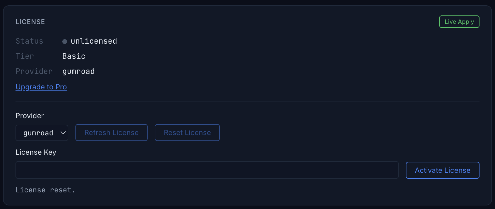

# Guia de Actualizacion a Pro

## ¿Por qué Pro?

### Sync bidireccional para flujos de desarrollo reales

Pro Sync va más allá del simple export. Edita scripts localmente y súbelos a Studio. Haz cambios en Studio y tráelos de vuelta al disco. Pro mantiene ambos lados sincronizados.

- **Sync bidireccional** — Los cambios fluyen en ambas direcciones entre Studio y los archivos locales.
- **Direction por tipo** — Configura la dirección de forma independiente para Scripts, Values, Containers, Data y Services.
- **Apply Mode por tipo** — Elige Auto o Manual por tipo para equilibrar velocidad y control.
- **Full Sync / Resync** — Reconstruye el estado limpio del proyecto tras cambios grandes o reconexiones.
- **Historial de cambios** — Rastrea qué cambió, cuándo y en qué dirección antes de aplicar.
- **Sync multi-place** — Sincroniza hasta 3 Roblox Places a la vez, cada uno con almacenamiento aislado e historial de cambios propio.

### Ahorra tokens de IA con flujos de alto impacto

Las acciones masivas y avanzadas reducen las llamadas repetitivas — haz más por cada prompt.

### IA que controla los playtests directamente

La IA puede controlar los playtests de Roblox Studio de forma directa. Puede iniciar y detener Play (F5) o Run (F8), inyectar scripts de prueba, recopilar logs y generar reportes automáticamente.

- "Inicia un playtest en modo Run y verifica si el NPC llega al objetivo."
- "Escribe un test que compruebe si el SpawnLocation está sobre el suelo y ejecútalo."
- "Valida que el script que acabo de cambiar funciona sin errores en el playtest."

### Más funciones exclusivas de Pro

Pro desbloquea funciones adicionales más allá del flujo de trabajo principal.

- **Operaciones masivas** — Crear, modificar o eliminar múltiples instancias en una sola solicitud
- **Generación de terreno** — Rellenar con bloque, esfera, cilindro, cuña y reemplazar materiales
- **Búsqueda/inserción de assets** — Buscar en el marketplace de Roblox e insertar assets directamente
- **Análisis espacial** — Raycast, encontrar suelo, búsqueda de área plana, detección de colisiones
- **Control de entorno** — Iluminación, atmósfera, cielo y hora del día
- **Audio/Animación** — Reproducción de sonido y carga/reproducción de animaciones

## Compra y activación

### Paso 1: Compra una licencia de suscripción Pro en Gumroad

1. Ve a [Gumroad - Weppy Roblox Plugin](https://gumroad.com/l/faccjs?utm_source=github&utm_medium=repo&utm_campaign=pro_upgrade_md)
2. Completa la compra de la licencia de suscripción Pro
3. Copia la clave de licencia que recibes después de la compra

Solo necesitas activar la licencia una vez, ya sea en el plugin o en el dashboard. Ambas superficies comparten el mismo estado local de licencia del MCP, así que al activarla en un lugar, el mismo estado aparecerá en el otro.

### Activar en el plugin

1. Abre **WEPPY** en Roblox Studio y conéctalo al servidor MCP.
2. Abre la sección **Settings > License** del plugin.
3. Pega la clave comprada en el campo `License key`.
4. Haz clic en **Activate** para activar la licencia.
5. Si el estado no se actualiza de inmediato, haz clic en **Refresh**.
6. Cuando la activación se complete, el estado cambiará de Basic a Pro y las funciones Pro quedarán disponibles.

### Activar en el dashboard

1. Inicia el servidor MCP y abre **Settings > License** en el dashboard.
2. Confirma que el proveedor esté configurado como `gumroad`.
3. Pega la clave comprada en el campo `License Key`.
4. Haz clic en **Activate License** para activar la licencia.
5. Si hace falta, usa **Refresh License** para obtener el estado más reciente.

### Después de activar

- Si el estado de la licencia aparece como `active` o `grace`, las funciones Pro ya están disponibles.
- El plugin y el dashboard comparten el mismo estado de licencia, así que la activación hecha en uno se refleja en el otro.
- Usa **Refresh** o **Refresh License** cuando quieras volver a comprobar el estado más reciente.

## Comparación de Funciones

| Función | Basic | Pro |
|---------|:-----:|:---:|
| Creación/edición de scripts | ✅ | ✅ |
| Crear/eliminar/mover instancias | ✅ | ✅ + operaciones masivas |
| Leer/modificar propiedades | ✅ | ✅ + cambios masivos |
| Selección, tags, búsqueda | ✅ | ✅ |
| Control de cámara | ✅ | ✅ |
| Monitoreo de logs | ✅ | ✅ |
| Ejecución de código Luau | ✅ | ✅ |
| Sincronización de proyecto | Studio → Local una vía | Bidireccional + dirección/modo por tipo |
| Sync multi-place | — | Hasta 3 Places simultáneamente |
| Historial de cambios | — | Rastreo de cambios antes de aplicar |
| Control de playtest | — | Reproducir / detener / pausar / reanudar + tests automáticos |
| Generación/edición de terreno | — | Bloque, esfera, cilindro, cuña, reemplazo de material |
| Búsqueda/inserción de assets | — | Buscar en marketplace de Roblox e insertar directamente |
| Análisis espacial | — | Raycast, encontrar suelo, detección de colisiones |
| Control de entorno | — | Iluminación, atmósfera, cielo, hora del día |
| Audio / Animación | — | Reproducción de sonido, carga/reproducción de animaciones |
| Eficiencia de tokens IA | Acciones individuales | Menos llamadas con acciones masivas |
