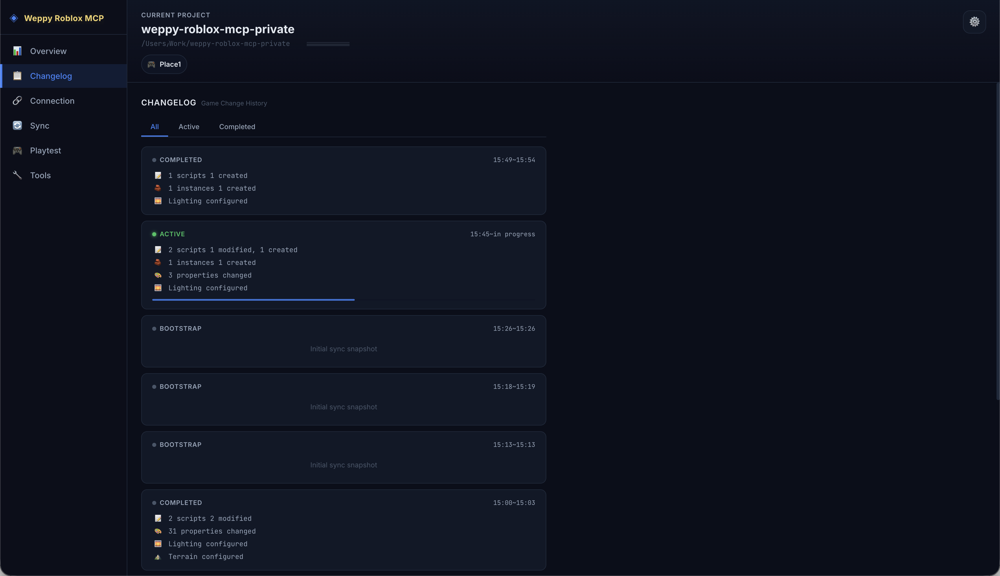
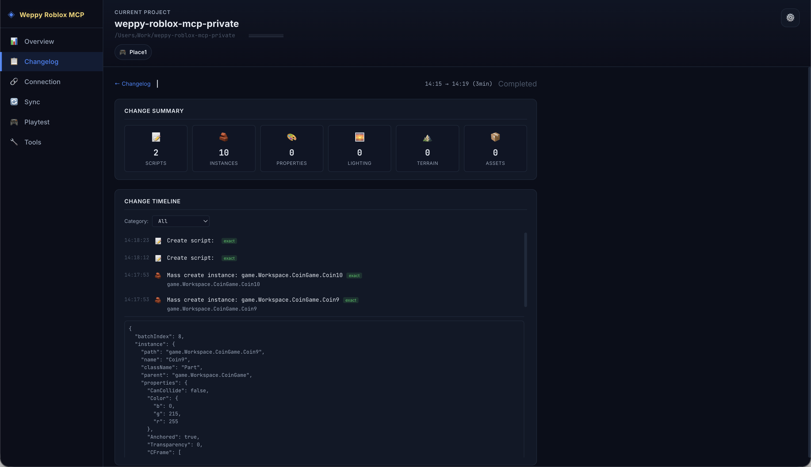

# Changelog

> Mencatat semua perubahan yang dilakukan AI di Roblox Studio per sesi, dan menyediakan ringkasan perubahan/timeline/Before & After.



## Ikhtisar

Changelog adalah halaman yang melacak riwayat perubahan game yang dilakukan agen AI di Studio. Perubahan dikelompokkan berdasarkan sesi, sehingga Anda dapat melihat sekilas jenis dan jumlah perubahan yang terjadi di setiap sesi.

## Daftar Kartu Sesi

Layar utama Changelog menampilkan daftar kartu per sesi.

### Status Sesi

Setiap kartu sesi menampilkan status:

| Status | Arti |
|--------|------|
| **Active** | Sesi yang sedang berlangsung (pembaruan real-time) |
| **Completed** | Sesi yang telah selesai |
| **Bootstrap** | Sesi sinkronisasi awal |

### Ringkasan Sesi

Setiap kartu merangkum jumlah perubahan sesi tersebut per kategori:

- Script — jumlah pembuatan/pengeditan script
- Instance — jumlah pembuatan/penghapusan/pemindahan instance
- Property — jumlah perubahan properti
- Lighting — jumlah pengaturan pencahayaan/lingkungan
- Terrain — jumlah perubahan terrain
- Asset — jumlah penyisipan aset

### Tab Filter

Anda dapat memfilter sesi menggunakan tab di bagian atas:
- **All** — semua sesi
- **Active** — hanya sesi yang sedang berlangsung
- **Completed** — hanya sesi yang telah selesai

## Tampilan Detail Sesi

Klik kartu sesi untuk masuk ke tampilan detail.



### Change Summary

Memvisualisasikan perubahan sesi dalam 6 kartu kategori:

| Kategori | Ikon | Deskripsi |
|----------|------|-----------|
| Scripts | Script | Jumlah pembuatan/pengeditan script |
| Instances | Instance | Jumlah pembuatan/penghapusan/pemindahan instance |
| Properties | Properti | Jumlah perubahan properti |
| Lighting | Pencahayaan | Jumlah perubahan pencahayaan/lingkungan |
| Terrain | Terrain | Jumlah perubahan terrain |
| Assets | Aset | Jumlah penyisipan aset |

### Change Timeline

Menampilkan semua perubahan dalam sesi secara kronologis.

- Setiap item menampilkan timestamp, tag kategori perubahan, dan path target
- Gunakan dropdown **Category** untuk memfilter kategori tertentu
- Klik item untuk membuka tampilan perbandingan Before & After

### Before & After

Membandingkan data sebelum dan sesudah perubahan. Tingkat informasi berbeda tergantung jenis perubahan:

| Tingkat Kepercayaan | Arti | Contoh |
|---------------------|------|--------|
| **exact** | Nilai sebelum dan sesudah tercatat dengan tepat | Perubahan properti, pengeditan script |
| **partial** | Hanya sebagian informasi yang tercatat | Perubahan kompleks |
| **after-only** | Hanya nilai sesudah yang tersedia | Pembuatan instance baru |
| **intent-only** | Hanya niat yang tercatat | Penghapusan, dll. |

## Contoh Penggunaan

### Verifikasi Pekerjaan

```
"Saya ingin mengecek script apa saja yang baru saja dimodifikasi oleh AI"
```

Filter kategori Script pada sesi Active di Changelog untuk melihat daftar script yang dimodifikasi dan membandingkan kode sebelum dan sesudah.

### Pelacakan Perubahan

```
"Saya ingin melihat kembali bagaimana Lighting diatur di sesi kemarin"
```

Cari sesi tersebut di tab Completed dan filter berdasarkan kategori Lighting untuk melihat riwayat perubahan dan nilai pengaturan.

### Debugging Masalah

```
"Saya perlu menemukan kapan instance tertentu dihapus"
```

Filter kategori Instance di timeline dan lacak perubahan tipe delete secara kronologis.

## Dokumen Terkait

- [WEPPY Dashboard Overview](overview.md)
- [Connection](connection.md)
- [Sync](sync.md)
- [Playtest](playtest.md)
- [Tools](tools.md)
- [Settings](settings.md)
