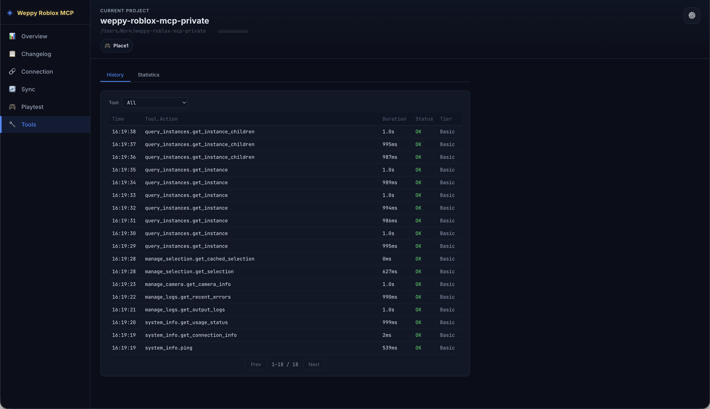

# Tools

> Periksa riwayat eksekusi dan statistik alat MCP yang dijalankan oleh AI.



## Ikhtisar

Halaman Tools menyediakan riwayat eksekusi dan statistik alat MCP yang dijalankan oleh AI. Terdiri dari dua sub-tab: **History** dan **Statistics**. Halaman ini selalu dapat diakses saat dashboard berada dalam status **Server terhubung** atau **Studio terhubung**.

## Tab History

Menampilkan riwayat eksekusi alat dalam tabel kronologis:

| Kolom | Deskripsi |
|-------|-----------|
| Time | Waktu eksekusi |
| Tool.Action | Alat dan aksi yang dieksekusi (contoh: `query_instances.get_instance`) |
| Duration | Durasi eksekusi |
| Status | Status hasil (OK/Error) |
| Tier | Tier yang digunakan (Basic/Pro) |

Fitur:
- Dropdown **Tool filter** untuk memfilter alat tertentu
- Paginasi untuk menelusuri riwayat dalam jumlah besar
- Penambahan riwayat eksekusi baru secara real-time

## Tab Statistics

Menganalisis statistik penggunaan alat secara visual:

- **Distribusi tier** — rasio penggunaan alat Basic/Pro
- **Statistik per alat** — jumlah panggilan dan rata-rata waktu respons setiap alat
- **Analisis per aksi** — statistik detail per aksi dalam alat

## Fitur Khusus Tier Basic

UI tambahan ditampilkan untuk pengguna tier Basic:

- **Tier Usage Progress** — progress bar penggunaan
- **Modal perbandingan Basic vs Pro** — informasi fitur tambahan tier Pro

## Contoh Penggunaan

### Analisis Performa Alat

```
"Saya ingin tahu alat mana yang paling lama eksekusinya"
```

Periksa rata-rata waktu respons per alat di tab Statistics.

### Pelacakan Error

```
"Saya ingin tahu mengapa alat yang baru saja dieksekusi gagal"
```

Cari item dengan Status Error di tab History untuk melihat informasi detail.

## Dokumen Terkait

- [WEPPY Dashboard Overview](overview.md)
- [Changelog](changelog.md)
- [Connection](connection.md)
- [Sync](sync.md)
- [Playtest](playtest.md)
- [Settings](settings.md)
- [Daftar tool lengkap](../tools/overview.md)
