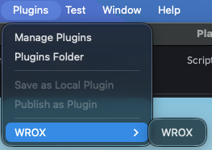
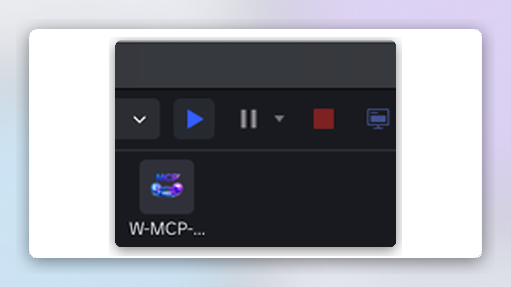
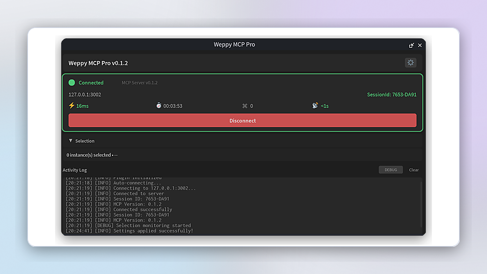

# Robloxプラグインのインストール

Roblox StudioでAIエージェントと連携するためのプラグインインストール方法です。

## 1. プラグインをダウンロード

1. [GitHub Releases](https://github.com/hope1026/roblox-mcp/releases/latest) を開く
2. `weppy-roblox-mcp-v{version}.zip` をダウンロード
3. ZIPを解凍 - `roblox-plugin/WeppyRobloxMCP.rbxm` とセットアップガイドを確認

メモ:
- Basicは同じプラグインパッケージを使い、Basicポリシー（Studio -> Local 片方向Sync）で動作
- Proサブスクライセンス有効化後、双方向Syncとより広い高度機能を利用可能

## 2. プラグインをインストール

1. **Roblox Studio** を起動
2. 上部メニューの **Plugins** タブをクリック
3. **Plugins Folder** ボタンをクリック

4. 解凍フォルダ内の `WeppyRobloxMCP.rbxm` を Plugins フォルダへ**コピー**
5. **Roblox Studioを再起動**

## 3. インストール確認

再起動後、Pluginsタブに **W-MCP** ボタンが表示されます。

## 4. AIエージェントに接続

### 事前準備

MCPサーバーがインストールされている必要があります。利用中のAIアプリのガイドを先に完了してください:

| AIアプリ | インストールガイド |
|-------|-------------|
| Claude Code | [設定方法](ai-apps/claude-code.md) |
| Claude Desktop | [設定方法](ai-apps/claude-app.md) |
| Codex CLI | [設定方法](ai-apps/codex-cli.md) |
| Codex Desktop | [設定方法](ai-apps/codex-app.md) |
| Gemini CLI | [設定方法](ai-apps/gemini-cli.md) |
| Antigravity | [設定方法](ai-apps/antigravity.md) |

### 接続

1. **Roblox Studio**で任意のプロジェクトを開く
2. **Plugins** タブ -> **W-MCP**
3. プラグインウィンドウで **Connect** をクリック
4. **"Connected"** が表示されたら完了

## 5. 設定（任意）

右上の設定ボタンからオプションを変更できます。

- **自動接続**: Studio起動時に自動接続
- **自動再接続**: 切断時に自動再接続
- **自動カメラフォーカス**: 生成オブジェクトへ自動フォーカス
- **言語**: UI言語を変更

## トラブルシューティング

### プラグインが表示されない

- Roblox Studioを完全終了して再起動
- Plugins Folderへのコピーを確認
- `.rbxm` が破損していないか確認

### 接続できない

- AIアプリでMCPサーバーが起動しているか確認
- **Connect** を再クリック
- ポート3002の競合を確認

### 接続が切れやすい

- 設定で **自動再接続** を有効化
- AIアプリを再起動
