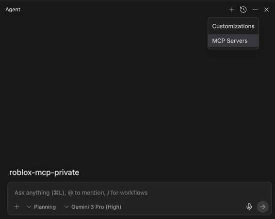
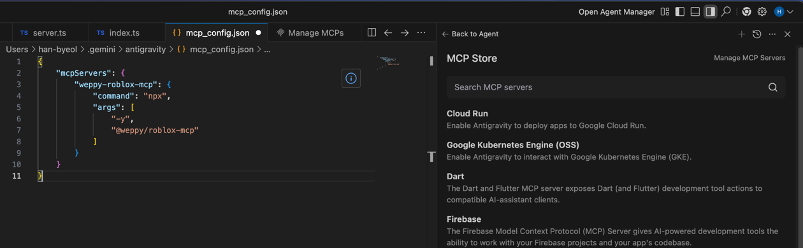

# Antigravity 설정

[Google Antigravity](https://developers.googleblog.com/build-with-google-antigravity-our-new-agentic-development-platform/)에서 Roblox MCP를 사용하는 방법입니다.

> **Antigravity**는 Google의 에이전트 기반 개발 플랫폼으로, AI 에이전트가 코드 편집, 터미널, 브라우저를 넘나들며 복잡한 작업을 자율적으로 수행합니다.

## 사전 요구사항

1. **Antigravity** 설치됨 (지원 OS/요구사항은 공식 문서 참고)
2. **Node.js** (v18.0.0 이상, `npx` 사용 가능)
3. **Roblox Studio 플러그인** 설치 완료

## MCP 서버 등록

Antigravity에서는 MCP 서버를 **에이전트 패널(Agent pane)**에서 관리합니다.

### Raw config로 수동 등록 (권장)

1. 에이전트 패널에서 **⋯** → **MCP Servers** → **Manage MCP Servers** → **View raw config** 클릭



2. 표시되는 설정(JSON)에 아래 내용을 추가/병합:

```json
{
  "mcpServers": {
    "weppy-roblox-mcp": {
      "command": "npx",
      "args": ["-y", "@weppy/roblox-mcp"]
    }
  }
}
```


3. 저장 후 **Refresh**(또는 UI 안내에 따른 재시작/새로고침) 수행

> 설정 파일의 실제 경로/이름은 OS와 Antigravity 버전에 따라 달라질 수 있으므로, 항상 **View raw config**에서 안내되는 위치를 기준으로 수정하세요.

### 옵션: 환경 변수로 포트/로그 조정

기본값(HTTP `127.0.0.1:3002`)을 유지하는 것을 권장합니다. 필요 시 아래처럼 환경 변수를 설정할 수 있습니다:

```json
{
  "mcpServers": {
    "weppy-roblox-mcp": {
      "command": "npx",
      "args": ["-y", "@weppy/roblox-mcp"],
      "env": {
        "HTTP_HOST": "127.0.0.1",
        "HTTP_PORT": "3002",
        "LOG_LEVEL": "INFO"
      }
    }
  }
}
```

## 연결 테스트

1. **Roblox Studio** 실행 → Plugins 탭 → **WROX** → **Connect**
2. **Antigravity**에서 다음을 입력:
   ```
   Roblox Studio에서 현재 선택된 것을 알려줘
   ```

## 문제 해결

### 서버가 시작되지 않을 때

MCP 서버를 직접 실행하여 오류를 확인하세요:
```bash
npx -y @weppy/roblox-mcp
```

### 연결 실패

- Roblox Studio 플러그인이 **Connected** 상태인지 확인
- 포트 **3002**가 방화벽에 의해 차단되지 않았는지 확인
- 에이전트 패널 **⋯** → **MCP Servers**에서 서버 상태 확인
- (고급) `HTTP_PORT`를 변경했다면, Roblox Studio 플러그인/브릿지 설정도 동일 포트를 사용하도록 맞춰야 합니다.

## 참고 자료

- [Google Antigravity 소개](https://developers.googleblog.com/build-with-google-antigravity-our-new-agentic-development-platform/)
- [Antigravity 시작 가이드 (Codelab)](https://codelabs.developers.google.com/getting-started-google-antigravity)
