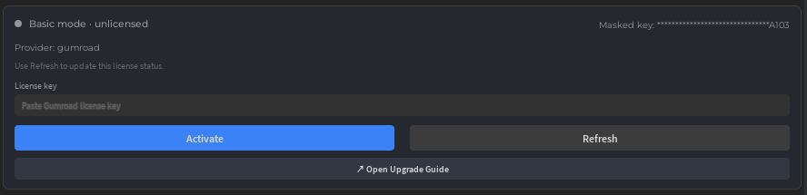

# Pro 업그레이드 가이드

## 왜 Pro인가?

### 실제 개발 워크플로우를 위한 양방향 Sync

Pro Sync는 단방향 내보내기를 넘어섭니다. 로컬에서 스크립트를 편집하고 Studio에 반영하세요. Studio에서 변경하고 로컬로 가져오세요. Pro는 양쪽을 항상 동기화합니다.

- **양방향 Sync** — Studio와 로컬 파일 간 양방향으로 변경사항이 흐릅니다.
- **타입별 Direction** — Scripts, Values, Containers, Data, Services를 각각 독립적으로 방향 설정.
- **타입별 Apply Mode** — 타입별로 Auto 또는 Manual을 선택하여 속도와 제어를 균형있게.
- **Full Sync / Resync** — 대규모 변경이나 재연결 후 즉시 깨끗한 프로젝트 상태를 재구축.
- **변경 기록** — 적용 전에 무엇이, 언제, 어느 방향으로 변경됐는지 추적.
- **멀티 Place Sync** — 최대 3개의 Roblox Place를 동시에 Sync하며, 각 Place마다 독립된 저장소와 변경 기록을 유지합니다.

### 고효율 워크플로우로 AI 토큰 절약

대량 및 고급 작업으로 반복 호출을 줄여 프롬프트 한 번에 더 많은 작업을 처리합니다.

### AI가 플레이테스트를 직접 제어

Studio 플레이테스트를 AI가 실행하고 검증합니다. F5(Play)/F8(Run) 시작/정지는 물론, 테스트 스크립트를 주입하고 로그를 수집해 리포트까지 자동 생성합니다.

- "Run 모드로 플레이테스트 시작하고, NPC가 목표 지점까지 이동하는지 확인해줘."
- "SpawnLocation이 지면 위에 있는지 테스트 스크립트를 작성해서 자동 실행해줘."
- "방금 수정한 스크립트가 에러 없이 동작하는지 플레이테스트로 검증해줘."

### 더 넓은 고급 기능

지형 생성, 에셋 검색, 공간 분석, 애니메이션, 오디오, 대규모 자동화.

## 구매 후 활성화

### 1단계: Gumroad에서 Pro 구독 라이선스 구매

1. [Gumroad - Weppy Roblox Plugin](https://gumroad.com/l/faccjs?utm_source=github&utm_medium=repo&utm_campaign=pro_upgrade_md) 접속
2. Pro 구독 라이선스 구매 완료
3. 결제 완료 후 받은 라이선스 키를 복사

라이선스는 **플러그인 또는 대시보드 중 한 곳에서만 한 번 활성화하면 충분합니다.** 두 화면은 같은 MCP 로컬 라이선스 상태를 공유하므로, 한쪽에서 활성화하면 다른 쪽에도 같은 상태가 반영됩니다.

### 플러그인에서 활성화

1. Roblox Studio에서 **WROX** 플러그인을 열고 MCP 서버에 연결합니다.
2. 플러그인의 **Settings > License** 섹션을 엽니다.
3. `License key` 입력창에 구매한 키를 붙여넣습니다.
4. **Activate** 버튼을 눌러 라이선스를 활성화합니다.
5. 상태가 바로 갱신되지 않으면 **Refresh** 버튼으로 다시 확인합니다.
6. 활성화가 완료되면 Basic 대신 Pro 상태로 표시되고 Pro 기능을 사용할 수 있습니다.

### 대시보드에서 활성화

1. MCP 서버를 실행한 뒤 대시보드의 **Settings > License** 섹션을 엽니다.
2. Provider가 `gumroad`로 선택되어 있는지 확인합니다.
3. `License Key` 입력창에 구매한 키를 붙여넣습니다.
4. **Activate License** 버튼을 눌러 라이선스를 활성화합니다.
5. 필요하면 **Refresh License**로 최신 상태를 다시 조회합니다.

### 활성화 후 확인

- 라이선스 상태가 `active` 또는 `grace`로 표시되면 Pro 기능을 사용할 수 있습니다.
- 플러그인과 대시보드는 같은 라이선스 상태를 공유하므로, 한쪽에서 활성화한 뒤 다른 쪽에서도 동일한 상태를 확인할 수 있습니다.
- 라이선스를 다시 확인해야 할 때는 `Refresh` 또는 `Refresh License`를 사용하세요.

## 기능 비교

| 기능 | Basic | Pro |
|-----|:-----:|:---:|
| Script, Instance, Property 관리 | ✅ 전체 사용 | ✅ 전체 사용 |
| Selection, Tag, Camera, Log | ✅ 전체 사용 | ✅ 전체 사용 |
| Sync 방향 | Studio → Local (단방향) | 양방향 |
| 타입별 Sync Direction | ❌ | ✅ Scripts / Values / Containers / Data / Services |
| 타입별 Apply Mode | ❌ | ✅ Auto / Manual |
| 변경 기록 | ❌ | ✅ |
| 멀티 Place Sync | ❌ | ✅ 최대 3개 Place, 각각 독립 저장소 |
| 플레이테스트 제어 (실행/정지/일시정지/재개) | ❌ | ✅ |
| 고급 Tool 범위 | 기본 범위 | 더 넓은 고급 범위 |
| AI 토큰 효율 | 기본 | 대량/고효율 action으로 더 유리 |
