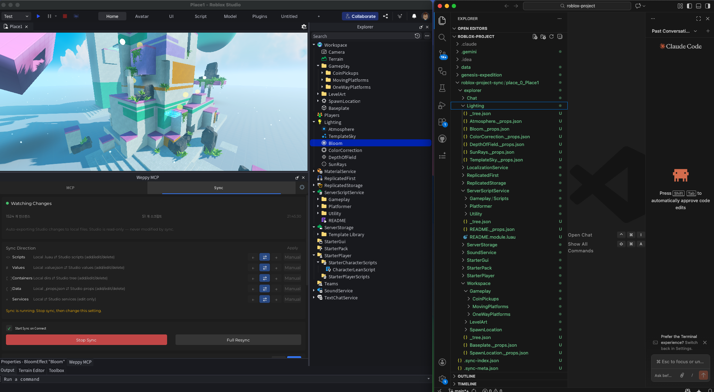
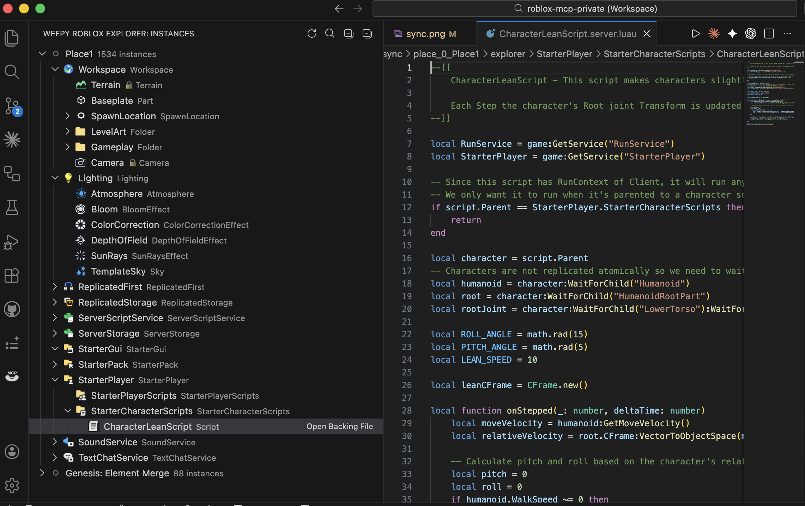
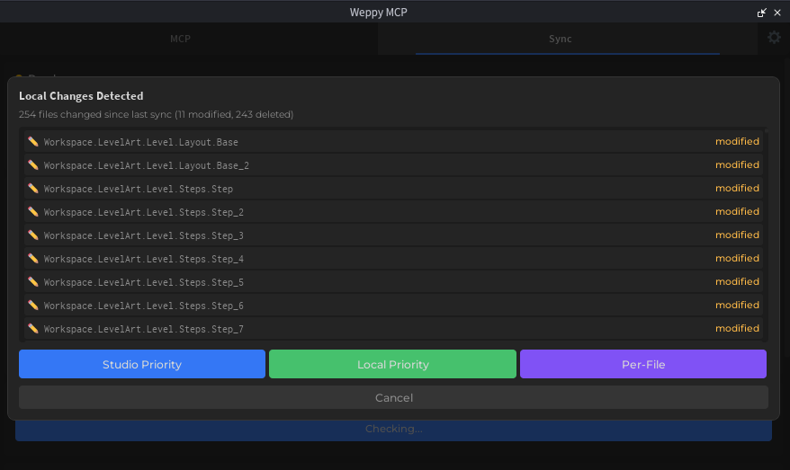

# Roblox MCP Sync 상세 가이드

Sync는 Roblox Studio 상태와 로컬 파일을 연결해, AI가 프로젝트 전체 문맥을 안정적으로 읽고 수정할 수 있게 만드는 기능입니다.

## 왜 Sync가 중요한가

Sync가 없으면 AI는 대화에 붙여 넣은 코드 일부만 보고 판단하게 됩니다. Sync를 켜면 프로젝트 전체를 기준으로 작업하므로 다음이 쉬워집니다.

- 여러 스크립트에 걸친 리팩터링을 일관되게 적용
- 변경 이력을 기반으로 위험한 수정만 빠르게 검토
- Studio와 로컬 중 어느 쪽이 기준인지 방향을 명확히 유지

## 기본 동작 방식



1. Full Sync: Studio 트리와 인스턴스를 로컬 미러로 초기 동기화
2. Incremental Sync: 변경 감시로 이후 변경분만 반영
3. History/Status 추적: 어떤 변경이 언제 어떤 방향으로 반영됐는지 확인

로컬 기본 경로는 `roblox-project-sync/place_{placeId}/explorer` 형태로 생성됩니다.

### VSCode에서 Sync 데이터 탐색

[Weepy Roblox Explorer](../installation/roblox-explorer.md) 확장을 설치하면, 동기화된 인스턴스 트리를 Roblox Studio와 동일한 형태로 VSCode에서 탐색할 수 있습니다.
Explorer는 여기서 생성된 sync 파일을 읽고, 로컬 MCP 서버가 실행 중이면 추가로 실시간 sync 상태와 direction 정보를 표시할 수 있습니다.



- 서비스/인스턴스 트리를 Roblox 클래스 아이콘과 함께 표시
- 스크립트 파일을 클릭하면 바로 편집 가능
- Sync 상태 배지로 변경/충돌 확인

## Basic vs Pro

| 항목 | Basic | Pro |
|------|------|-----|
| 동기화 방향 | Studio -> Local | 양방향 |
| 타입별 Direction | 미지원 | 지원 (Scripts / Values / Containers / Data / Services) |
| 타입별 Apply Mode | 미지원 | 지원 (Auto / Manual) |
| 상태/기록 조회 API | 미지원 | 지원 (`status`, `history`, `progress`) |
| `manage_sync` 도구 사용 | 미지원 | 지원 |
| 멀티 Place Sync | 미지원 | 지원 (최대 3개 Place) |

## 동기화 대상과 기본 제외 규칙

기본 동기화 대상 서비스:

- `Workspace`
- `Lighting`
- `ReplicatedStorage`
- `ServerStorage`
- `ServerScriptService`
- `StarterGui`
- `StarterPlayer`
- `StarterPack`
- `ReplicatedFirst`
- `SoundService`
- `Chat`
- `LocalizationService`

기본 제외 항목:

- 클래스: `Terrain`, `Camera`
- 보안상 금지 경로: `CoreGui`, `CorePackages`, `RobloxScript`, `RobloxScriptSecurity`

## Direction과 Apply Mode

### Direction (타입별 동기화 방향)

- `forward`: Studio -> Local
- `reverse`: Local -> Studio
- `bidirectional`: 양방향

타입은 `scripts`, `values`, `containers`, `data`, `services`로 분리되어 관리됩니다.

### Apply Mode (reverse 변경 적용 방식)

- `manual`: Studio 반영 전 사용자가 확인 후 적용
- `auto`: 감지된 변경을 자동 적용

Pro에서는 타입별로 Direction/Apply Mode를 다르게 설정해 워크플로우를 세밀하게 제어할 수 있습니다.

## `manage_sync` 액션 가이드 (Pro)

| 액션 | 설명 | 주요 인자 |
|------|------|-----------|
| `status` | 현재 Place의 동기화 상태 확인 | `placeId` |
| `config` | 동기화 설정 확인 | `placeId` |
| `history` | 변경 기록 조회 | `placeId`, `query.limit`, `query.offset` |
| `directions` | 타입별 Direction 조회 | `placeId` |
| `read_file` | 동기화된 파일 읽기 | `placeId`, `instancePath` |
| `write_file` | 동기화된 파일 쓰기 | `placeId`, `instancePath`, `content` |
| `progress` | 실시간 진행률/처리량 확인 | `placeId` |

## 추천 워크플로우

### 1) 안전하게 시작하기

- 먼저 Full Sync를 완료해 현재 상태를 기준점으로 만듭니다.
- 초반에는 `manual` 적용으로 운영해 변경 위험을 줄입니다.

### 2) AI와 함께 변경하기

- "Sync 상태 확인하고, 최근 변경 기록 기준으로 위험한 변경만 요약해줘"
- "`ServerScriptService` 쪽 스크립트만 우선 리팩터링하고, 변경 이력까지 남겨줘"

### 3) 충돌 발생 시 해결하기

양방향 동기화 중 Studio와 로컬 양쪽에서 변경이 감지되면, 아래와 같은 충돌 해결 화면이 나타납니다.



- **Studio Priority**: Studio 쪽 상태를 기준으로 덮어쓰기
- **Local Priority**: 로컬 파일을 기준으로 Studio에 반영
- **Per-File**: 파일별로 어느 쪽을 우선할지 개별 선택

### 4) 문제 발생 시 복구하기

- `history`로 최근 변경을 추적
- 필요한 파일을 `read_file`로 확인
- 복구할 내용을 `write_file`로 반영 후 Studio 상태 재확인

## 파일 포맷 (v2 nested directory)

각 Roblox 인스턴스는 자체 디렉토리로 저장되며, 해당 디렉토리 안에 메타 파일이 위치합니다:

```
explorer/
├── Workspace/
│   ├── _tree.json
│   ├── Part/
│   │   └── Part.props.json
│   ├── MyScript/
│   │   └── MyScript.server.luau
│   └── Coins/
│       └── Coins.value.json
```

파일 명명 규칙:
- 속성: `{Name}/{Name}.props.json`
- 스크립트: `{Name}/{Name}.server.luau` / `.client.luau` / `.module.luau`
- 값: `{Name}/{Name}.value.json`

동일 이름 인스턴스는 디렉토리에 `~N` 접미사를 붙여 구분합니다 (예: `Part~2/Part.props.json`).
이름에 `~`가 포함되면 `~~`로 이스케이프됩니다 (예: `Part~2` → `Part~~2/`). Odd-Count Tilde 규칙: 끝의 `~+N`에서 tilde 개수가 홀수일 때만 collision suffix로 해석됩니다.

## 함께 보면 좋은 문서

- [Tool 지원 범위 (Tools Overview)](../tools/overview.md)
- [Pro 업그레이드 가이드](../pro-upgrade.md)
