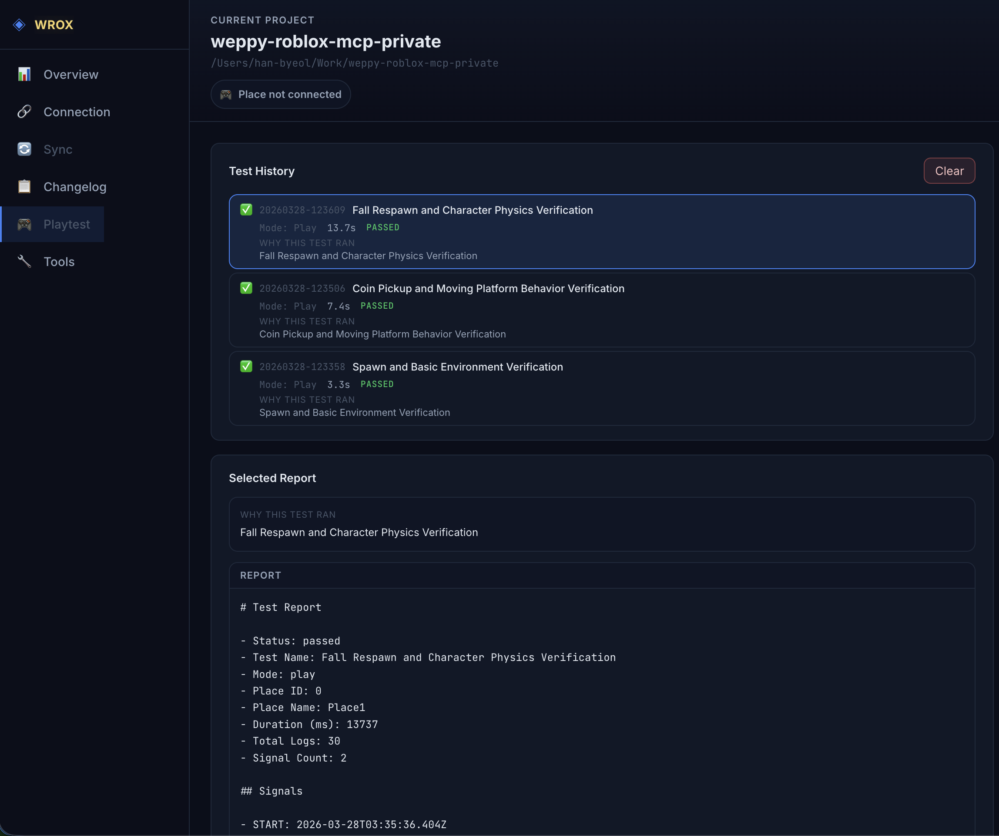
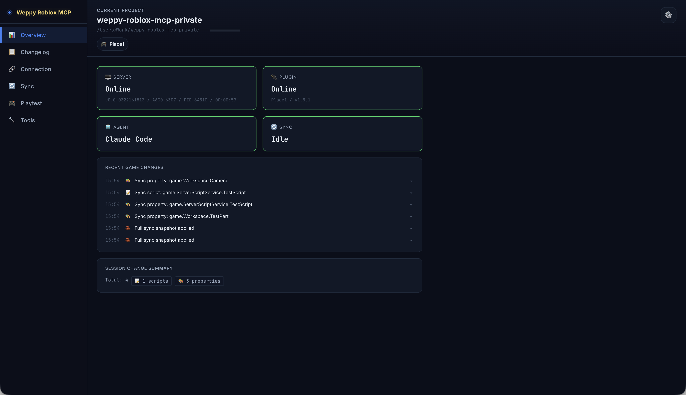

# Roblox MCP — Servidor MCP para Roblox Studio | Desenvolvimento de jogos com IA usando Claude, Codex, Cursor e Gemini

> **WROX** e um servidor MCP que permite agentes de codificacao IA controlarem uma sessao ao vivo do Roblox Studio — crie e edite scripts, instancias, terrain, iluminacao, assets, audio e animacoes com linguagem natural.

**Ferramentas consolidadas baseadas em ações · Sync bidirecional · Playtest automatizado · Suporte multi-place**

[English](../../README.md) | [한국어](../ko/README.md) | [日本語](../ja/README.md) | [Español](../es/README.md) | **Português** | [Bahasa Indonesia](../id/README.md)

[](https://youtu.be/puQB4u1VlMw)

## Por que WROX (Weppy Roblox MCP)?

Agentes de codificação IA como Claude, Codex e Gemini são poderosos — mas não conseguem ver nem modificar nada dentro do Roblox Studio. O DataModel, scripts, terrain e iluminação são todos invisíveis para ferramentas externas. Sem uma ponte, a IA só pode gerar trechos de código que você precisa colar manualmente.

**WROX** é uma ponte entre agentes de IA e o Roblox Studio. A IA cria e modifica diretamente instâncias, scripts, propriedades, terrain e mais dentro do Studio, e as alterações são refletidas imediatamente no Studio e no dashboard para que você possa **ver exatamente o que mudou**.

Sem necessidade de copiar e colar código. A IA trabalha e você confere os resultados.

## Instalacao rapida

Instale seguindo o guia na pagina web.

👉 **[Pagina de instalacao](https://weppy-web.pages.dev/en/install)**

### Instalacao por terminal

Se voce esta confortavel com o terminal, instale tudo em uma linha.

**macOS / Linux**

```bash
curl -fsSL https://raw.githubusercontent.com/hope1026/weppy-roblox-mcp/main/install.sh | bash
```

**Windows (PowerShell)**

```powershell
irm https://raw.githubusercontent.com/hope1026/weppy-roblox-mcp/main/install.ps1 | iex
```

Reinicie o Roblox Studio — pronto!

O registro automático de MCP suporta **Claude Code, Claude Desktop, Cursor, Codex CLI/App, Gemini CLI e Antigravity**.

Se a execução do PowerShell estiver bloqueada no Windows, siga a instalação manual abaixo. Se estiver usando o pacote ZIP, você também pode usar `setup-plugin.bat` e `setup-mcp.bat`.

### Instalacao manual

Se a instalacao em um comando nao funcionar, ou se a instalacao automatica nao puder ser usada no seu ambiente, use a instalacao manual abaixo como alternativa.

**Passo 1** — Instale o plugin do Roblox Studio:
[Guia de instalacao do plugin](https://weppy-web.pages.dev/en/install#plugin)

**Passo 2** — Registre o servidor MCP no seu app de IA:

```bash
npx -y @weppy/roblox-mcp
```

| App de IA | Guia |
|-----------|------|
| Claude Code | [Configuracao](installation/ai-apps/claude-code.md) |
| Claude Desktop | [Configuracao](installation/ai-apps/claude-app.md) |
| Cursor | [Configuracao](installation/ai-apps/cursor.md) |
| Codex CLI | [Configuracao](installation/ai-apps/codex-cli.md) |
| Codex Desktop | [Configuracao](installation/ai-apps/codex-app.md) |
| Gemini CLI | [Configuracao](installation/ai-apps/gemini-cli.md) |
| Antigravity | [Configuracao](installation/ai-apps/antigravity.md) |

> Funciona com qualquer cliente MCP compativel. O comando do servidor e `npx -y @weppy/roblox-mcp`.

## Compatibilidade

| Claude Code | Claude Desktop | Cursor | Codex CLI | Gemini CLI | Antigravity |
|:-----------:|:--------------:|:------:|:---------:|:----------:|:-----------:|
| ✅ | ✅ | ✅ | ✅ | ✅ | ✅ |

**Requisitos:** Node.js 18+, Roblox Studio, Windows 10+ ou macOS 12+

## Funcionalidades principais

### 1) MCP Tool: execucao direta no Studio via linguagem natural

A IA consegue operar diretamente scripts, instancias, propriedades, terreno, iluminacao, assets, audio e animacao dentro do Studio.

- "Adiciona particulas + som + cooldown quando o jogador pular."
- "Cria uma arena de boss no centro do mapa e coloca spawns sem colisao."
- "Muda a interface deste modulo e atualiza todos os scripts dependentes."

### 2) Sync: mantem contexto completo do projeto para a IA

A IA trabalha com um espelho local sincronizado, entao alteracoes em varios arquivos continuam consistentes.

- Basic: sincronizacao unidirecional (Studio -> Local)
- Pro: sincronizacao bidirecional + Direction/Apply Mode por tipo + historico + multiplace


### 3) Playtest: a IA executa e valida testes automaticamente

A IA pode controlar diretamente o playtest do Studio. Ela pode iniciar e parar Play (F5) ou Run (F8), injetar scripts de teste, coletar logs e gerar relatorios locais automaticamente.

- "Inicie um playtest em modo Run e verifique se o NPC chega ao objetivo."
- "Escreva e execute um teste para confirmar que o SpawnLocation esta acima do chao."
- "Valide com playtest se o script que acabei de alterar roda sem erros."



### 4) WROX Dashboard: monitore as operacoes da IA em tempo real

No dashboard web fornecido pelo servidor MCP, acompanhe em tempo real o status de conexao, historico de execucao de ferramentas, status de sincronizacao e historico de alteracoes do jogo.

- Visualize o status de conexao do servidor/plugin/agente de uma so vez
- Compare todas as alteracoes feitas pela IA com Before & After no Changelog
- Analise o fluxo de trabalho com historico e estatisticas de execucao de ferramentas



### 5) WROX Roblox Explorer: navegue a hierarquia do Studio no VSCode

Visualize a arvore completa de instancias do seu lugar no Roblox Studio diretamente dentro do VSCode. Navegue pelos servicos, abra scripts e arquivos de propriedades sincronizados, e acompanhe o status de sincronizacao — tudo sem trocar para o Studio.
WROX Roblox Explorer e uma extensao complementar do VSCode para os dados de sync gerados pelo WROX. A navegacao basica da arvore funciona a partir dos arquivos sincronizados em disco, e os indicadores ao vivo de status sync ou direction ficam mais completos quando o servidor MCP local esta em execucao.
Instale pela [VS Code Marketplace](https://marketplace.visualstudio.com/items?itemName=weppy.weppy-roblox-explorer) ou pela [Open VSX](https://open-vsx.org/extension/weppy/weppy-roblox-explorer).

- Icones de classe iguais ao Studio para reconhecimento imediato
- Clique para abrir scripts e arquivos de propriedades sincronizados
- Suporte multiplace com indicadores de status de sincronizacao


## Valor imediato para o usuario

- Comprimir trabalho repetitivo: transformar muitas edicoes manuais em um pedido
- Alterar arquivos relacionados juntos: nao apenas um arquivo alvo
- Reduzir risco: decidir com base no estado do sync e no historico
- Melhor eficiencia de tokens (Pro): menos round trips com acoes em massa

## Casos de uso

- **Prototipagem rápida**: Descreva uma mecânica de jogo em linguagem natural e veja a IA construí-la no Studio
- **Refatoração em massa**: Renomeie uma interface de módulo e atualize todos os scripts dependentes em uma única solicitação
- **Terrain e ambiente**: Gere terrain procedural, configure iluminação/atmosfera, posicione assets — tudo a partir de um único prompt
- **Consistência multi-arquivo**: A IA lê o projeto completo via Sync e aplica alterações em scripts relacionados de forma conjunta
- **Integração de assets**: Pesquise no Creator Store, insira modelos e configure propriedades sem sair do editor

## Documentacao detalhada

- [Guia de instalacao](installation/README.md)
- [Lista completa de tools](tools/overview.md)
- [Guia detalhado de Sync](sync/overview.md)
- [Guia do WROX Dashboard](dashboard/overview.md)
- [WROX Roblox Explorer (Extensao VSCode)](installation/roblox-explorer.md)
- [Compatibilidade](../compatibility.md)
- [Solucao de problemas](../troubleshooting.md)

### Guias por fluxo

- [Instancias e propriedades](tools/instances-and-properties.md) - busca, criacao, edicao e tags
- [Scripts e execucao de codigo](tools/scripting.md) - gerenciamento de scripts e execucao de Luau
- [Mundo e ambiente](tools/world-and-environment.md) - iluminacao, terrain e camera
- [Assets e efeitos](tools/assets-and-effects.md) - insercao de modelos, tween e efeitos
- [Playtest e testes automatizados](tools/playtest.md) - controle de playtest e validacao automatica
- [Sistema e depuracao](tools/system-and-debugging.md) - conexao, logs e execucao em lote

## FAQ

### Como conecto o Claude Code ao Roblox Studio?
Instale o plugin do Roblox Studio e registre o servidor MCP (`npx -y @weppy/roblox-mcp`) no Claude Code. O Claude poderá ler e escrever scripts diretamente dentro do Studio. Consulte [Configuração do Claude Code](installation/ai-apps/claude-code.md).

### Como uso o Codex CLI com o Roblox Studio?
Instale o plugin e adicione a configuração do servidor MCP ao Codex CLI. Consulte [Configuração do Codex CLI](installation/ai-apps/codex-cli.md).

### O Roblox MCP funciona com o Cursor?
Sim. Consulte [Configuração do Cursor](installation/ai-apps/cursor.md). Qualquer cliente de IA compatível com MCP funciona.

### A IA pode criar jogos Roblox com isso?
Sim. A IA pode criar instâncias, escrever scripts, gerar terrain, configurar iluminação, inserir assets, configurar física e mais — tudo dentro de uma sessão de Studio ao vivo. Vai além da geração de código para ações executáveis.

### Qual é a diferença entre Basic e Pro?
Basic (gratuito) inclui execução de ferramentas MCP e sincronização unidirecional (Studio -> Local). Pro adiciona sincronização bidirecional, operações em massa, geração de terrain, análise espacial, controle de áudio/animação e suporte multi-place. Consulte o [Guia de upgrade Pro](https://weppy-web.pages.dev/en/plans).

### Como o Weppy se diferencia de outros servidores MCP para Roblox?
O Weppy usa despacho baseado em ações em vez de ferramentas separadas para cada função. Isso reduz significativamente o consumo de tokens de IA. Também fornece sincronização bidirecional de projeto e suporte multi-place, que a maioria das alternativas não possui.

### É seguro? A IA pode quebrar meu jogo?
O servidor roda apenas em localhost (127.0.0.1:3002). Caminhos proibidos (CoreGui, CorePackages) são bloqueados. Limitação de taxa (450 req/min) e timeouts de 30 segundos previnem operações descontroladas. Todas as alterações são rastreáveis pelo histórico de sincronização.

## Upgrade Pro

Sync bidirecional, recursos avancados de criacao e eficiencia de tokens de IA — tudo em uma unica atualizacao.

[Guia de upgrade Pro](https://weppy-web.pages.dev/en/plans)

## Licença

Este repositório está licenciado sob `AGPL-3.0`.

Licenciamento comercial está disponível separadamente. Consulte [COMMERCIAL-LICENSE.md](../../COMMERCIAL-LICENSE.md).

O uso do nome e logotipos Weppy é regido por [TRADEMARKS.md](../../TRADEMARKS.md).

---

[](https://www.npmjs.com/package/@weppy/roblox-mcp) [](https://nodejs.org/) [](https://smithery.ai/server/@hope1026/weppy-roblox-mcp)

[](https://glama.ai/mcp/servers/hope1026/roblox-mcp)

[GitHub Issues](https://github.com/hope1026/weppy-roblox-mcp/issues) · [Discussions](https://github.com/hope1026/weppy-roblox-mcp/discussions) · [npm](https://www.npmjs.com/package/@weppy/roblox-mcp)
