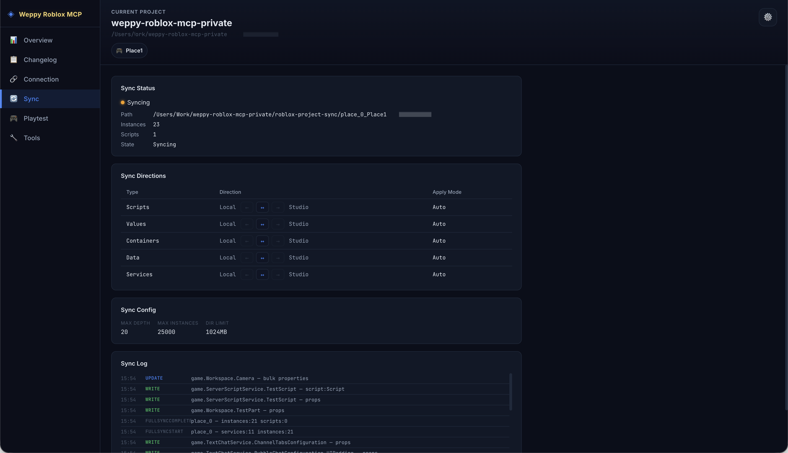

# Sync

> Monitore o status atual, configuracao de direcao e logs da sincronizacao Studio <-> arquivos locais.



> Para o guia detalhado da funcionalidade Sync em si, consulte o [Guia detalhado de Sync](../sync/overview.md).

## Visao geral

A pagina Sync exibe visualmente o status atual e as configuracoes da sincronizacao Studio <-> arquivos locais. So fica acessivel quando o dashboard esta em estado **Studio conectado**.

## Sync Status

Exibe o status atual da sincronizacao:

| Status | Significado |
|--------|-------------|
| **Idle** | Aguardando sincronizacao |
| **Initializing** | Sincronizacao inicial em andamento |
| **Syncing** | Sincronizacao incremental em andamento |
| **Error** | Erro de sincronizacao ocorrido |

O card de status tambem exibe o caminho de sincronizacao, a quantidade de instancias sincronizadas e o modo de aplicacao atual (Auto/Manual).

## Sync Directions

Exibe em tabela a direcao de sincronizacao por tipo:

| Coluna | Descricao |
|--------|-----------|
| Type | Tipo do alvo de sincronizacao (Scripts, Values, Instances, Data, Services) |
| Direction | Direcao da sincronizacao (Local -> Studio, Studio -> Local) |
| Apply Mode | Modo de aplicacao (Auto/Manual) |

Verifique a direcao de sincronizacao de cada tipo para entender em qual sentido as alteracoes sao refletidas.

## Sync Log

Exibe os eventos de sincronizacao em ordem cronologica. Cada entrada de log inclui uma tag de tipo de alteracao (create, update, delete, etc.) e o caminho do alvo.

## Casos de uso

### Verificacao do status de sincronizacao

```
"Quero verificar se o Sync esta funcionando corretamente"
```

Confirme se o Sync Status esta Idle e verifique no Sync Log se as alteracoes recentes foram registradas normalmente.

### Identificacao da direcao de sincronizacao

```
"Quero saber em qual direcao as alteracoes de script sao sincronizadas"
```

Verifique a Direction do tipo Scripts na tabela Sync Directions.

## Documentos relacionados

- [WROX Dashboard Overview](overview.md)
- [Changelog](changelog.md)
- [Connection](connection.md)
- [Playtest](playtest.md)
- [Tools](tools.md)
- [Settings](settings.md)
- [Guia detalhado de Sync](../sync/overview.md)
