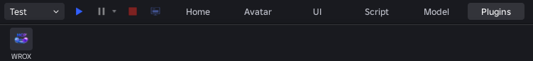
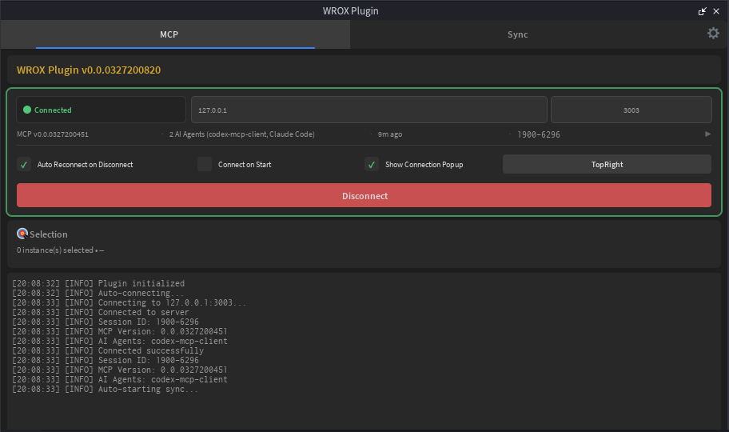
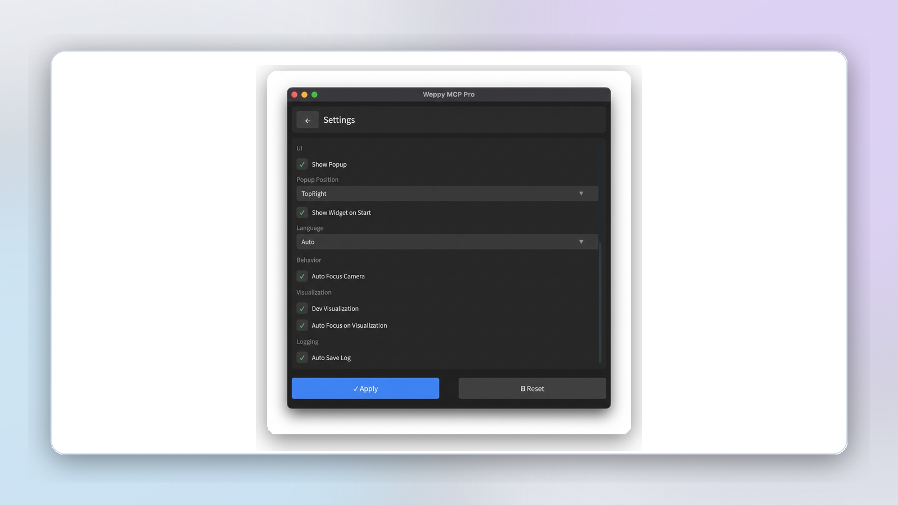

# Instalacao do Plugin Roblox

Como instalar o plugin para conectar agentes de IA no Roblox Studio.

## 1. Baixar o Plugin

1. Abra [GitHub Releases](https://github.com/hope1026/weppy-roblox-mcp/releases/latest)
2. Baixe `weppy-roblox-mcp-v{version}.zip`
3. Extraia o ZIP - voce encontrara `roblox-plugin/WeppyRobloxMCP.rbxm` e guias de instalacao

Nota:
- Basic usa o mesmo pacote com politica Basic (Studio -> Local, unidirecional)
- Com licenca Pro por assinatura, sync bidirecional e recursos avancados mais amplos sao liberados

## 2. Instalar o Plugin

1. Inicie o **Roblox Studio**
2. Clique na aba **Plugins**
3. Clique em **Plugins Folder**

4. **Copie** `WeppyRobloxMCP.rbxm` para a pasta de Plugins
5. **Reinicie o Roblox Studio**

## 3. Verificar a Instalacao

Apos reiniciar, o botao **WROX** aparecera na aba Plugins.

## 4. Conectar ao Agente de IA

### Pre-requisitos

O servidor MCP deve estar instalado. Complete primeiro o guia do seu app de IA:

| Aplicativo de IA | Guia de Instalacao |
|------------------|---------------------|
| Claude Code | [Como Configurar](ai-apps/claude-code.md) |
| Claude Desktop | [Como Configurar](ai-apps/claude-app.md) |
| Cursor | [Como Configurar](ai-apps/cursor.md) |
| Codex CLI | [Como Configurar](ai-apps/codex-cli.md) |
| Codex Desktop | [Como Configurar](ai-apps/codex-app.md) |
| Gemini CLI | [Como Configurar](ai-apps/gemini-cli.md) |
| Antigravity | [Como Configurar](ai-apps/antigravity.md) |

### Conectar

1. Abra qualquer projeto no **Roblox Studio**
2. Aba **Plugins** -> **WROX**
3. Clique em **Connect**
4. Quando aparecer **"Connected"**, esta pronto

## 5. Configuracoes (Opcional)

Use o botao de configuracoes no canto superior direito.

- **Conexao Automatica**
- **Reconexao Automatica**
- **Foco Automatico da Camera**
- **Idioma**

## Solucao de Problemas

### O plugin nao aparece

- Reinicie o Roblox Studio por completo
- Verifique se o arquivo foi copiado corretamente
- Verifique se `.rbxm` nao esta corrompido

### Nao consigo conectar

- Verifique se o servidor MCP esta em execucao
- Clique em **Connect** novamente
- Verifique conflito na porta 3002

### A conexao cai frequentemente

- Ative **Reconexao Automatica**
- Reinicie o app de IA
