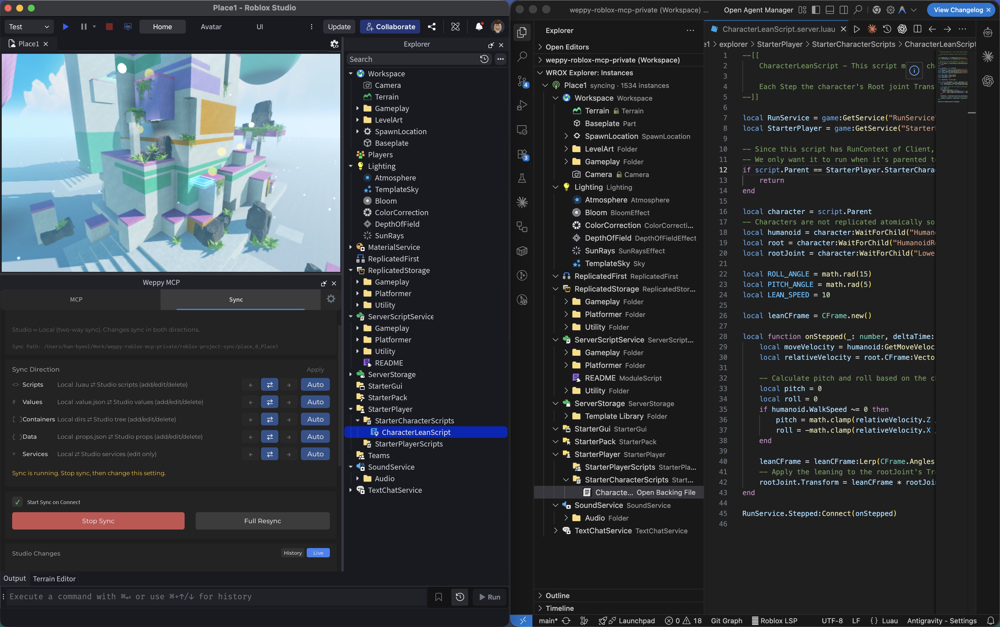

# Guia detalhado de Sync no Roblox MCP

Sync conecta o estado do Roblox Studio com arquivos locais para que a IA consiga ler e modificar o contexto completo do projeto com confianca.

## Por que Sync importa

Sem Sync, a IA so enxerga trechos colados no chat. Com Sync ativo, ela trabalha com o projeto inteiro.

- Aplicar refactors de forma consistente em varios scripts
- Revisar mudancas de risco rapidamente usando historico
- Manter clara a fonte de verdade entre Studio e arquivos locais

## Como funciona



1. Full Sync: espelho inicial da arvore/instancias do Studio para local
2. Incremental Sync: atualizacao continua das mudancas novas
3. Rastreamento de History/Status: ver o que mudou, quando e em qual direcao

Os dados de Sync ficam em `{projectRoot}/weppy-project-sync/place_{placeId}/explorer`.
Alem disso, o WEPPY grava um sourcemap por place em `{projectRoot}/weppy-project-sync/place_{placeId}/sourcemap.json` e mantem o arquivo representativo recomendado na raiz em `{projectRoot}/weppy-project-sync/sourcemap.json`.
Para integracoes de editor como `luau-lsp`, o caminho da raiz e o recomendado. Os passos de configuracao estao em [Usar `luau-lsp` com WEPPY Sync](./luau-lsp.md).

### Explorar dados sincronizados no VSCode

Instale a extensao [WEPPY Roblox Explorer](../explorer/overview.md) para explorar a arvore de instancias sincronizada no VSCode, assim como no Roblox Studio.
O Explorer le os arquivos de sync gerados aqui e tambem pode mostrar status sync ao vivo e informacoes de direction quando o servidor MCP local estiver em execucao.


- Arvore de servicos/instancias com icones de classes Roblox
- Clique em um script para abri-lo e editar
- Badges de status de sync mostram estado modificado/conflito

## Basic vs Pro

| Item | Basic | Pro |
|------|------|-----|
| Direcao de sync | Studio -> Local | Bidirecional |
| Direction por tipo | Nao suportado | Suportado (Scripts / Values / Containers / Data / Services) |
| Apply Mode por tipo | Nao suportado | Suportado (Auto / Manual) |
| APIs de status/historico | Nao suportado | Suportado (`status_current_place`, `history`, `progress`) |
| Ferramenta `manage_sync` | Nao suportado | Suportado |
| Sync multiplace | Nao suportado | Suportado (ate 3 places) |

## Alvos de sync e exclusoes padrao

Servicos sincronizaveis por padrao:

- `Workspace`
- `Lighting`
- `ReplicatedStorage`
- `ServerStorage`
- `ServerScriptService`
- `StarterGui`
- `StarterPlayer`
- `StarterPack`
- `ReplicatedFirst`
- `SoundService`
- `Chat`
- `LocalizationService`

Exclusoes padrao:

- Classes: `Terrain`, `Camera`
- Caminhos restritos por seguranca: `CoreGui`, `CorePackages`, `RobloxScript`, `RobloxScriptSecurity`

## Direction e Apply Mode

### Direction (direcao por tipo)

- `forward`: Studio -> Local
- `reverse`: Local -> Studio
- `bidirectional`: duas direcoes

Os tipos sao gerenciados separadamente: `scripts`, `values`, `containers`, `data`, `services`.

### Apply Mode (como mudancas reverse sao aplicadas)

- `manual`: usuario confirma antes de aplicar no Studio
- `auto`: mudancas detectadas sao aplicadas automaticamente

No Pro, voce controla Direction e Apply Mode por tipo.

## Guia de acoes `manage_sync` (Pro)

| Acao | Descricao | Parametros principais |
|------|------|-----------|
| `status_current_place` | Consultar o estado atual de sync do Place conectado | `-` |
| `history` | Consultar historico de mudancas | `placeId`, `query.limit`, `query.offset` |
| `directions` | Obter direcoes por tipo | `placeId` |
| `read_file` | Ler arquivo sincronizado | `placeId`, `instancePath` |
| `write_file` | Escrever arquivo sincronizado | `placeId`, `instancePath`, `content` |
| `progress` | Obter progresso/throughput em tempo real | `placeId` |

## Fluxo recomendado

### 1) Comecar com seguranca

- Complete o Full Sync primeiro para estabelecer uma base estavel
- Comece com modo `manual` para reduzir risco

### 2) Trabalhar com IA

- "Verifica o estado do sync e resume so mudancas de risco do historico recente"
- "Refatora primeiro scripts de `ServerScriptService` e registra no historico"

### 3) Resolver conflitos

Quando mudancas sao detectadas tanto no Studio quanto no local durante a sincronizacao bidirecional, um dialogo de resolucao de conflitos aparece.


- **Studio Priority**: sobrescrever usando o estado do Studio como fonte de verdade
- **Local Priority**: aplicar arquivos locais ao Studio
- **Per-File**: escolher qual lado tem prioridade para cada arquivo individualmente

### 4) Recuperar quando necessario

- Acompanhe mudancas recentes com `history`
- Inspecione o arquivo alvo com `read_file`
- Restaure conteudo com `write_file` e valide no Studio

## Formato de arquivos (v2 nested directory)

Cada instancia Roblox e armazenada como seu proprio diretorio com arquivos meta dentro:

```
explorer/
├── Workspace/
│   ├── _tree.json
│   ├── Part/
│   │   └── Part.props.json
│   ├── MyScript/
│   │   └── MyScript.server.luau
│   └── Coins/
│       └── Coins.value.json
```

Convencoes de nomes:
- Propriedades: `{Name}/{Name}.props.json`
- Scripts: `{Name}/{Name}.server.luau` / `.client.luau` / `.module.luau`
- Valores: `{Name}/{Name}.value.json`

Instancias com nome duplicado usam o sufixo `~N` no diretorio (ex: `Part~2/Part.props.json`).
Nomes que contem `~` sao escapados como `~~` (ex: `Part~2` → `Part~~2/`). Regra Odd-Count Tilde: um `~+N` final e interpretado como sufixo de colisao somente quando a quantidade de tildes e impar.

## Documentos relacionados

- [Usar `luau-lsp` com WEPPY Sync](./luau-lsp.md)
- [Cobertura de ferramentas (Tools Overview)](../tools/overview.md)
- [Guia de upgrade Pro](https://weppyai.com/en/plans)
